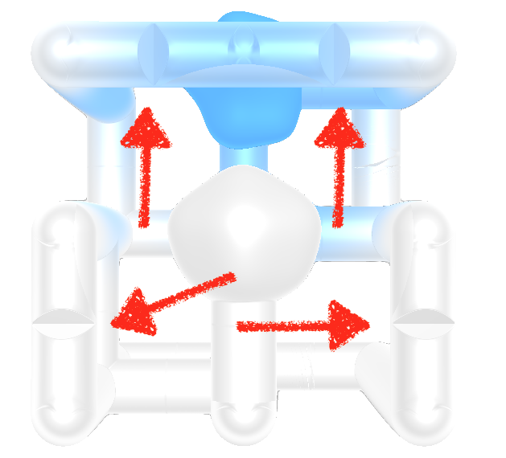

# AMAZ3D

[-> LINK TO THE GAME ENTRY <-](http://js13kgames.com/entries/amaz3d)

> AMAZ3D is a game, made in a few days for [js13k 2017 gamejam](http://js13kgames.com/entries/amaz3d).

**AMAZ3D is a 3D Maze puzzle. connect 2 metaballs by rotating the maze cube. Progress over more and more complex levels.**


Controls:
- on desktop, you can use the keyboard (QSZD / ASWD / arrows + optional use of SHIFT)
- you can also plug a XBox controller in!
- on mobile, just drag to rotate.

<iframe width="560" height="315" src="https://www.youtube.com/embed/O2MadzsGANA" frameborder="0" allowfullscreen></iframe>


## Mea Culpa

That game is not finished as I wish it was *(I had only a ~2 days window this time)*. It would definitely deserve more work in the level design & generation as well as more game mechanisms to be funnier to play.

I still like this current state even if everything is a bit unpolished (some level tends to be harder even at beginning). I'm a bit surprised and didn't expect a 3D maze was kinda challenging.

**Rotating** the cube instead of moving in a static world makes it more challenging because you quickly become **LOST**. You kinda need to memorize the 3D path as you rotate to go faster.
Another challenge in the game is, when there are pipe intersection and you want to make a turn, you need to have the correct rotation so you fall in the turn. This makes it very challenging when there are lot of intersection.

## Tech Notes

The game graphics are implemented with Signed Distance Functions raymarching technique running in a single GLSL fragment shader.

This is in continuation of my 2 previous games: https://github.com/gre/memocart and https://github.com/gre/ld39 .

### Preamble: 3D map cell: coordinate vs index

Given a map dimension (e.g. 8x8x8),

There are 2 ways a map cell is represented:
- the classical coordinate format: `[x,y,z]` (where x,y,z are integer contained in the map dimension (e.g. `0<=x<dim[0]`))
- the index format: `number`. (an integer from 0 to dim³)

We can move from one format to the other with these:

```js
// where dim is the game dimension
function indexToCoord(dim, i) {
  var v = Math.floor(i / dim[2]);
  var z = i - v * dim[2];
  i = v;
  v = Math.floor(i / dim[1]);
  var y = i - v * dim[1];
  var x = v;
  return [x, y, z];
}
function coordToIndex(dim, p) {
  return (p[0] * dim[1] + p[1]) * dim[2] + p[2];
}
```

### how the world 3D maze is generated, encoded, and rendered

First of all, the generation is done by JavaScript. The data structure I used on the JS side is an array of edges. Where an edge is just a pair of two cell indexes, sorted (e.g. `[ 10, 20 ]`).
The map generation algorithm will generate this array of edges by exploring the map, it's a simple algorithm that keep track of explored points and just loop on chosing a random next neighbor to move to. (It is sometimes run multiple times to generate multiple unconnected graphs.)

This data structure is convenient to implement the game logic that check if an intersection between 2 cell exists to apply the physics, etc...

We also need to encode this map so it is sent to the GLSL fragment rendering. A GLSL shader don't have access to JavaScript memory at all, but you can "upload" data to it from JavaScript (via uniforms).
In our case, the map is already quite a lot of data and we can't use the primitive uniform types. We can't use an array neither because we would quickly reach the [MAX_FRAGMENT_UNIFORM_VECTORS](http://webglstats.com/webgl/parameter/MAX_FRAGMENT_UNIFORM_VECTORS) GL limitation (the value heavily varies across graphic cards).
Instead, the "hack" is to use a **texture**! textures are built-in supported in GPU and can be pretty big, that's therefore the most common way to do GPGPU things with WebGL. We can create and bind a texture with a JavaScript UInt8Array.
Hopefully I only need to do this when the map changes but here is how it works:

```js
var length = map.dim[0] * map.dim[1] * map.dim[2];
mapData = new Uint8Array(length);
for (var i = 0; i < length; i++) {
  mapData[i] =
    getCellConnections(state, indexToCoord(map.dim, i))
    .reduce((acc, n) => (acc << 1) | n, 0)
    << 2;
}
```

`getCellConnections` returns an array of boolean that check if there is a connection with the 6 neighbors. It it more convenient for rendering to use this new data format (instead of the edges array) so the rendering will directly know what a given cell is connected to with a simple array lookup.

Cell connections data are encoded in the texture using 6 biggest bit of Uint8.

so at the end, the texture is just a 256x1 image in case of a 8x8x8 map. First thing we can do is implement cellValue, an utility function to retrieve the array value of a 3D coordinate with a texture lookup:

```glsl
float cellValue (vec3 id) {
  return texture2D(mapT, vec2(
    (
      id[2] + mapDim[2] * (id[1] + mapDim[1] * id[0]) // index
     + 0.5 // safe for windows
    ) / (
      mapDim[0]*mapDim[1]*mapDim[2]
    ), 0.5)
  ).r;
}
```

and then we can decode it!

> in GLSL, texture value is between 0.0 and 1.0, not actually a integer!! so to decode the data in WebGL bit by bit, we have no other choice than using these `*= 2.`. (we could cast to int, but WebGL1 don't even support the binary operators).

```glsl
float v = cellValue(cellCoordinate);
v *= 2.;
float right = floor(v);
v -= right;
v *= 2.;
float left = floor(v);
v -= left;
v *= 2.;
float up = floor(v);
v -= up;
v *= 2.;
float down = floor(v);
v -= down;
v *= 2.;
float front = floor(v);
v -= front;
v *= 2.;
float back = floor(v);
```

These value allow to add or not some cylinder to render the pipe system.

The [vec2 sdCell (vec3 p, float v, vec3 id)](src/shaders/game.frag#L62) GLSL function do this job in the signed distance function paradigm.

## rendering don't loop on all map cells

One important point to understand for this paradigm is we're not actually going to loop over all cells to render them all! What we do is, for a given position, figuring out what cell we're in. And to do that, we can simply use this `pMod3` function:

```glsl
vec3 pMod3(inout vec3 p, vec3 size) {
  vec3 c = floor((p + size*0.5)/size);
  p = mod(p + size*0.5, size) - size*0.5;
  return c;
}
```

like this:

```glsl
vec3 id = pMod3(p, vec3(1.0));
// p is now modified in place to be the cell relative position
// id contains the cell coord (e.g. (1,3,5) )
float cell = cellValue(id);
if (cell != 0.) { // (DAMN i should have tried to avoid this if^^)
  d = opU(d, sdCell(p, cell, id));
}
else {
  // see note below...
  d = opU(d, vec2(0.03 + vmin(vec3(
    mix(0.5 - p.x, 0.5 + p.x, step(0.,dir.x)),
    mix(0.5 - p.y, 0.5 + p.y, step(0.,dir.y)),
    mix(0.5 - p.z, 0.5 + p.z, step(0.,dir.z))
  ) / (1.0 + dir)), 0.));
}
```

> In the else block, you see a complex formula.. what this is trying to do is giving the closest distance to the next cell (in the ray direction). This is a hack and don't work that well (Have not really figured out the proper way yet to avoid the **mod() edge glitch**)

### mod() edge glitch



this is the downside of the no-loop approach: in some cases, a ray might miss a cell object! especially when objects touches the edge of the cell... that's a complex problem (attempted to be solved with the else block above). One way could have been to consider the neighbor when rendering one cell, but still you could fall in the problem again if there is nothing in 2 consecutive cells..

### adding more glitches as a feature

Running out of time fixing this glitch, I've decided to actually add in more glitches at important moment: when the game starts, when the game is about to time out. I let you discover them yourself :)
